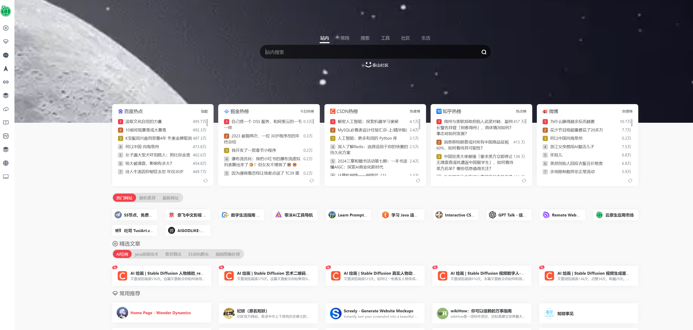
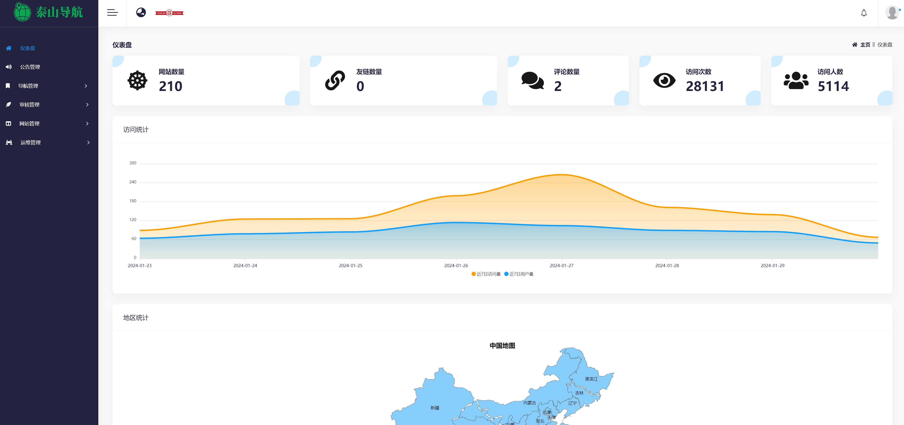
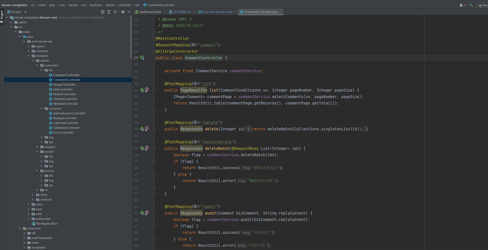
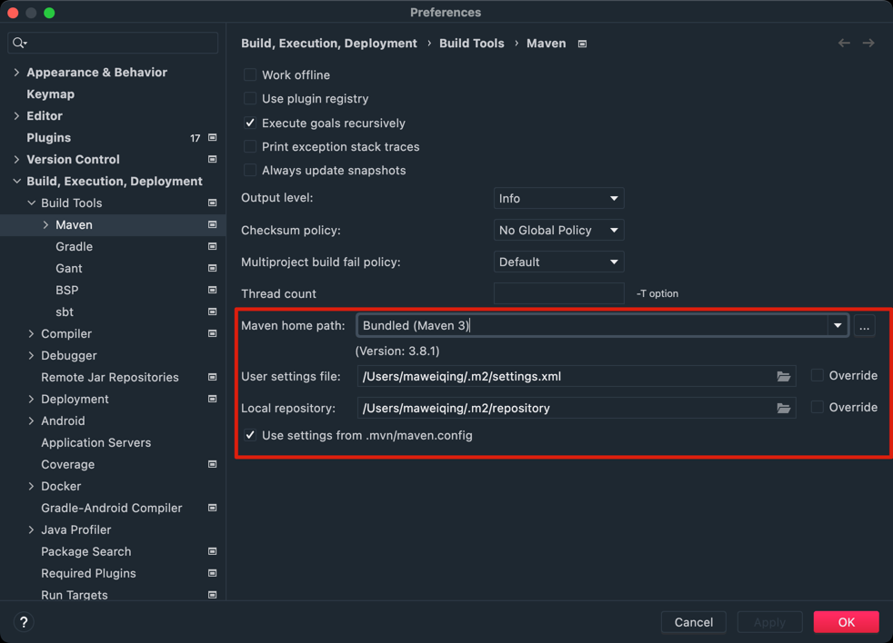

# TARZAN-NAV 导航网站

一个基于 Spring Boot、MyBatis-Plus、h2database、ehcache、Docker、websocket等技术栈实现的导航网站系统，采用主流的互联网技术架构、全新的UI设计、支持一键源码部署，拥有完整的仪表板、导航管理，用户管理、评论管理、友情链接、公告管理、运维管理等，代码完全开源，没有任何二次封装，是一个非常适合二次开发/实战的现代化导航项目👍 。

## 我的博客

1. **JAVA OPC UA专栏**：[https://blog.csdn.net/weixin_40986713/category_12356608.html](https://blog.csdn.net/weixin_40986713/category_12356608.html)
2. **AI绘画 | Stable diffusion**：[https://blog.csdn.net/weixin_40986713/category_12481790.html](https://blog.csdn.net/weixin_40986713/category_12481790.html) 
3. **java高级技术专栏**：[https://blog.csdn.net/weixin_40986713/category_10796066.html](https://blog.csdn.net/weixin_40986713/category_10796066.html)
4. **java Selenium自动化爬虫**：[https://blog.csdn.net/weixin_40986713/category_12165790.html](https://blog.csdn.net/weixin_40986713/category_12165790.html)
5. **java 推荐算法专栏**：[https://blog.csdn.net/weixin_40986713/category_12268014.html](https://blog.csdn.net/weixin_40986713/category_12268014.html)
6. **Java视频图像处理专栏**：[https://blog.csdn.net/weixin_40986713/category_11109931.html](https://blog.csdn.net/weixin_40986713/category_11109931.html) 

## 一、目标使命

- 打造一个性能最好，在同等资源下，实现最大的用户并发数。
- 部署简单，让技术小白也能部署使用
- 增强用户体验，更好的UI交互，操作体验

## 二、项目介绍

### 项目演示

#### 项目源码地址

- 项目仓库（GitHub）：[https://github.com/taishan666/tarzan-navigation](https://github.com/taishan666/tarzan-navigation)
- 项目仓库（码云）：[https://gitee.com/taisan/tarzan-navigation](https://gitee.com/taisan/tarzan-navigation)

#### 前台社区系统


- 项目演示地址：[http://82.157.61.108/](http://82.157.61.108/)



#### 后台社区系统

- 项目演示地址：[http://82.157.61.108/admin](http://82.157.61.108/admin)



#### 代码展示




### 架构图

#### 系统架构图


#### 业务架构图


#### 环境配置说明

安装 jdk1.8+

在application-dev.yml 或者application-prod.yml文件中修改 自己的邮箱配置，其他保持保持默认接口


#### 配置文件说明

- resources
    - application.yml: 主配置文件入口
    - application-dev.yml: 开发环境配置
    - application-prod.yml: 生成环境配置
    - ehcache.xml  本地缓存配置
    - logback-spring.xml: 日志打印相关配置文件

### 技术选型

后端技术栈

|         技术          | 说明                   | 官网                                                                                                 |
|:-------------------:|----------------------|----------------------------------------------------------------------------------------------------|
| Spring & SpringMVC  | Java全栈应用程序框架和WEB容器实现 | [https://spring.io/](https://spring.io/)                                                           |
|     SpringBoot      | Spring应用简化集成开发框架     | [https://spring.io/projects/spring-boot](https://spring.io/projects/spring-boot)                   |
|       mybatis       | 数据库orm框架             | [https://mybatis.org](https://mybatis.org)                                                       |
|    mybatis-plus     | 数据库orm框架             | [https://baomidou.com/](https://baomidou.com/)                                                     |
|        ehcache        | 内存数据存储               | [https://www.ehcache.org/](https://www.ehcache.org/)                                                                                                         |                                                       |
|       docker        | 应用容器引擎               | [https://www.docker.com](https://www.docker.com)                                                   |
|      hikariCP       | 数据库连接                | [https://github.com/brettwooldridge/HikariCP](https://github.com/brettwooldridge/HikariCP)         |
|         oss         | 对象存储                 | [https://help.aliyun.com/document_detail/31883.html](https://help.aliyun.com/document_detail/31883.html)                                               |
|        https        | 证书                   | [https://letsencrypt.org/](https://letsencrypt.org/)                                               |
|         jwt         | jwt登录                | [https://jwt.io](https://jwt.io)                                                                   |
|       lombok        | Java语言增强库            | [https://projectlombok.org](https://projectlombok.org)                                             |
|        guava        | google开源的java工具集     | [https://github.com/google/guava](https://github.com/google/guava)                                 |
|      thymeleaf      | html5模板引擎            | [https://www.thymeleaf.org](https://www.thymeleaf.org)                                             |
|       swagger       | API文档生成工具            | [https://swagger.io](https://swagger.io)                                                           |
| hibernate-validator | 验证框架                 | [hibernate.org/validator/](hibernate.org/validator/)                                               |
|     quick-media     | 多媒体处理                | [https://github.com/liuyueyi/quick-media](https://github.com/liuyueyi/quick-media)                 |
|      liquibase      | 数据库版本管理              | [https://www.liquibase.com](https://www.liquibase.com)                                             |
|       jackson       | json/xml处理           | [https://www.jackson.com](https://www.jackson.com)                                                 |
|      ip2region      | ip地址                 | [https://github.com/zoujingli/ip2region](https://github.com/zoujingli/ip2region)                   |
|      websocket      | 长连接                  | [https://docs.spring.io/spring/reference/web/websocket.html](https://docs.spring.io/spring/reference/web/websocket.html)                   |
|      sensitive-word      | 敏感词                  | [https://github.com/houbb/sensitive-word](https://github.com/houbb/sensitive-word)                   |


## 三、环境搭建

### 开发工具

|        工具        | 说明           | 官网                                                                                                           | 
|:----------------:|--------------|--------------------------------------------------------------------------------------------------------------|
|       IDEA       | java开发工具     | [https://www.jetbrains.com](https://www.jetbrains.com)                                                       |
|      Chrome      | 浏览器          | [https://www.google.com/intl/zh-CN/chrome](https://www.google.com/intl/zh-CN/chrome)                         |
|     Postman      | API接口调试      | [https://www.postman.com](https://www.postman.com)                                                           |
|     draw.io      | 流程图、架构图绘制    | [https://www.diagrams.net/](https://www.diagrams.net/)                                                       |
|      Axure       | 原型图设计工具      | [https://www.axure.com](https://www.axure.com)                                                     |
|     navicat      | 数据库连接工具      | [https://www.navicat.com](https://www.navicat.com)                                                           |
|     DBeaver      | 免费开源的数据库连接工具 | [https://dbeaver.io](https://dbeaver.io)                                                                     |
|      xshell      | 终端模拟软件      | [https://www.xshell.com/zh/xshell/](https://www.xshell.com/zh/xshell/)                                                                     |


### 开发环境

|      工具       | 版本        | 下载                                                                                                                     |
|:-------------:|:----------|------------------------------------------------------------------------------------------------------------------------|
|      jdk      | 1.8+      | [https://www.oracle.com/java/technologies/downloads/#java8](https://www.oracle.com/java/technologies/downloads/#java8) |
|     maven     | 3.4+      | [https://maven.apache.org/](https://maven.apache.org/)                                                                 |
|    ali-oss    | 3.15.1    | [https://help.aliyun.com/document_detail/31946.html](https://help.aliyun.com/document_detail/31946.html)               |
|      git      | 2.34.1    | [http://github.com/](http://github.com/)                                                                               |
|    docker     | 4.10.0+   | [https://docs.docker.com/desktop/](https://docs.docker.com/desktop/)                                                   |
| let's encrypt | https证书   | [https://letsencrypt.org/](https://letsencrypt.org/)                                                                   |

### 搭建步骤

## 1. 环境准备

首先准备好基础的开发环境，如

- jdk/jre: 请安装jdk8+以上版本
- maven: 本项目基于maven作为项目管理工具，因此在启动之前请配置好maven相关环境
- git版本管理
- 开发工具：建议idea，当然eclipse/vs也没有问题

## 2. 项目启动

当环境准备完毕之后，接下来就是下载项目，导入开发工具进行启动演示

### 2.1 项目获取

本项目所有源码开源，因此您可以在github/gitee上免费获取

**通过git方式拉取项目**

```bash
# Git clone
git clone git@gitee.com:taisan/tarzan-navigation.git
```

**下载release包**

若希望从一个稳定的版本进行尝试，推荐在release页下载zip包，然后本机解压

- [https://gitee.com/taisan/tarzan-navigation/releases](https://gitee.com/taisan/tarzan-navigation/releases)

### 2.2 项目导入

以IDEA开发工具为例

- File -> Open
- 选择第一步clone的项目工程

项目导入成功之后，会自动下载依赖、构建索引，此过程用时取决于您的机器性能+网速，通常会持续一段时间，请耐心等待。

如果发现项目 build 未成功或者无法运行 Java 程序，要立马检查一下自己 Intellij IDEA 中的 Maven 是否配置成功。




### 2.3 配置修改

在正式启动项目之前，还有几个前置步骤需要执行一下

#### 2.3.1 数据库准备

本项目会使用数据库，因此在本机启动时，请先指定数据库；项目中默认的数据库名为 `paicoding`，可以通过修改配置文件中的`database.name`参数来替换为您喜欢的数据库名

数据库名配置: [tarzan-navigation/src/main/resources/application.yml](../tarzan-navigation/src/main/resources/application-dev.yml)

```yaml
spring:
  datasource:
    type: com.alibaba.druid.pool.DruidDataSource
    driverClassName: org.h2.Driver
    url:  jdbc:h2:file:${user.home}/.tarzan-nav/db/tarzan-nav;MODE=MYSQL
    username: root
    password: 123456
  mail:
    host: smtp.163.com
    username: vxhqqh@163.com
    password: TRXZYKQFHNZHOYMB
    default-encoding: UTF-8
    protocol: smtp
    properties:
      mail:
        smtp:
          auth: true # 启用SMTP认证
          starttls:
            enabled: true # 启用SMTP认证
            required: true # 必须采用加密链接
```

> 本项目提供了自动创建库表的功能，在项目启动之后，当库不存在时，会创建库；当表不存在时，会自动创建表，且会初始化一些测试数据

#### 2.3.2 数据库配置

接下来我们需要做的就是设置数据库的相关连接配置

首先在进入之前，先简单了解一下配置，我们做了环境区分,在resources文件夹下，

- dev: 本地开发环境
- prod: 生产环境

默认的环境选择是`dev`，可以通过下面两种方式进行环境切换

### 2.4 启动

接下来就可以直接启动项目了

进入启动类: `NavApplication`


启动完毕之后，将会在控制台看到如下输出


点击控制台中的链接进入首页, 默认首页为: [http://127.0.0.1:80](http://127.0.0.1:80)


## 许可证

[Apache License 2.0](https://gitee.com/taisan/tarzan-navigation/edit/master/README.md)

Copyright (c) 2022-2032 洛阳泰山


#### 技术交流&问题反馈
      联系QQ:1334512682 微信号：vxhqqh
     

[问题交流反馈平台](https://support.qq.com/product/592558)
